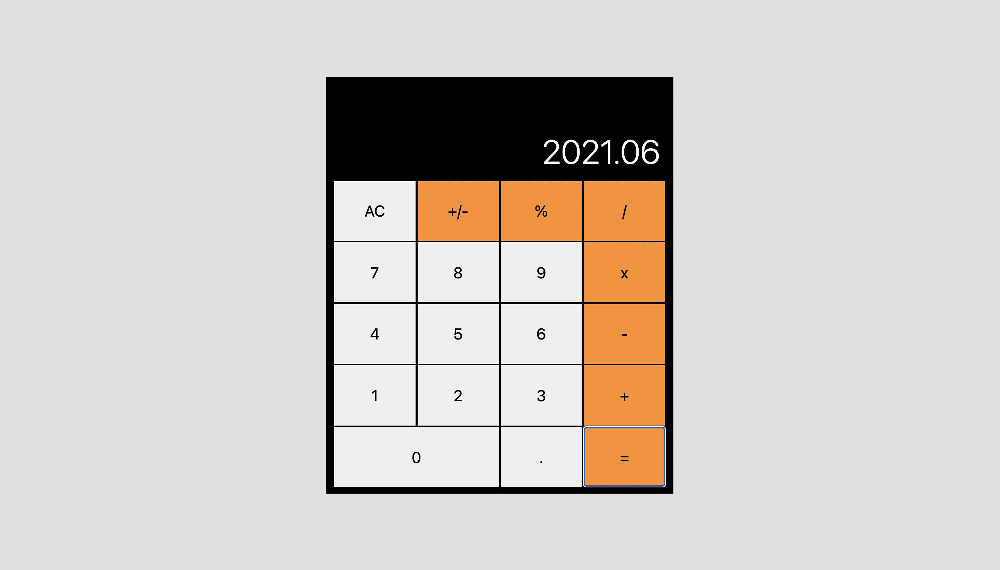

## Basic Calculator with React

## Live Link
[Click here](https://basic-calculator-react.herokuapp.com/) to use the calculator
### Objectives:
- Building a simple React application
- Working with React classes
- Functional programming
- Meeting model client requirements

## Features
A fully functional calculator that performs arithmetic operations. The following operations are supported: `addition, subtraction, multiplication, division, percentage, negation, decimals`. For evaluations longer than 12 values, the calculator returns an exponential form. The operation carried out is displayed in the top left corner. Use the `AC` button to clear the display

## Prerequisites
- Internet Connection
- An Integrated Development Environment
- Chrome, Firefox or Safari.
- Node Package Manager [(NPM)](https://docs.npmjs.com/about-npm)

## Tools/Built With
- Node.js
- React
- React-DOM
- React-Create-App
- npm
- CSS
- Javascript ES6+
- Heroku

## Getting Started
- To get started with the app, clone this project by running `git clone https://github.com/george-swift/react-calculator.git`
- `cd` into the directory and run `npm install` to install the needed packages and dependencies
- A development tool is included in the npm script. Run `npm start` to fire up a local server with live reloading.
- If not already redirected, visit `http://localhost:3000/` in your browser to use the calculator.
- To terminate the server, enter `Ctrl + C` in your terminal

## Testing
Run `npm test` to test the application
## Authors

👤 &nbsp; **Ubong George**
- LinkedIn: [Ubong George](https://www.linkedin.com/in/ubong-itok)
- Twitter: [@\_\_pragmaticdev](https://twitter.com/__pragmaticdev)
- GitHub: [@george-swift](https://github.com/george-swift)

## Acknowledgments

- [React Team](https://reactjs.org/)
- [Big.js](http://mikemcl.github.io/big.js/#)
- [Microverse](https://www.microverse.org)

## Show your support

Leave a :star:️ &nbsp; if you like this project!

## License

Available as open source under the terms of the [MIT License](https://opensource.org/licenses/MIT).