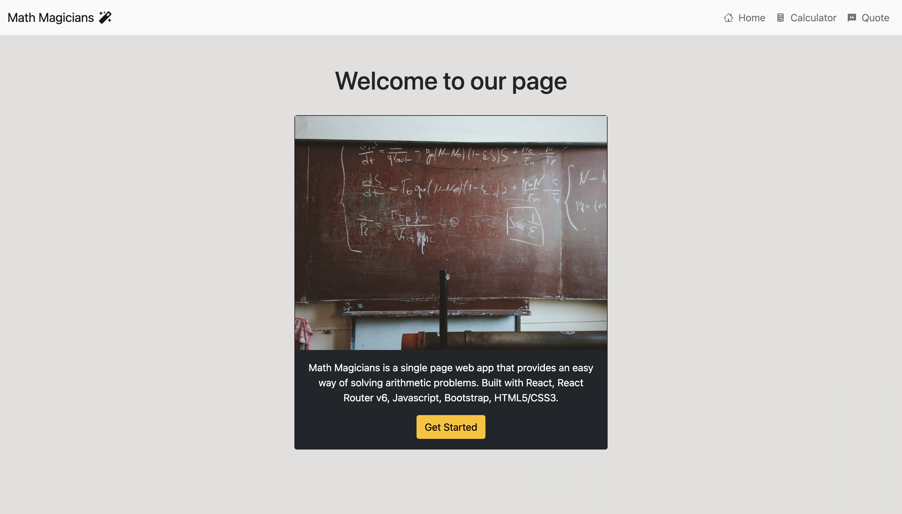
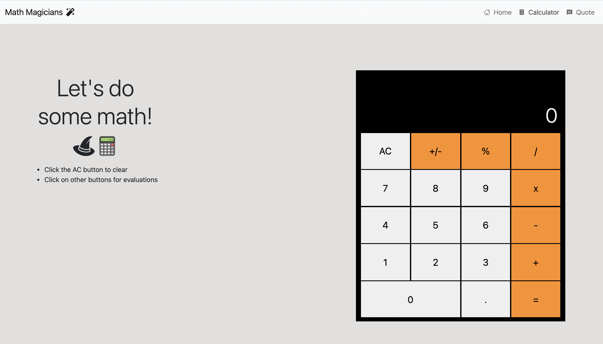
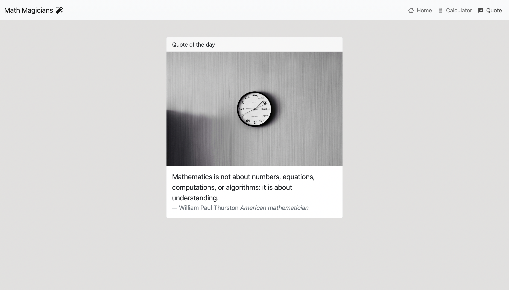

## Math Magicians

## Live Link
[Click here](https://math-magicians-react.herokuapp.com/) to visit Math Magicians
### Objectives:
- Building a single page application (SPA) with React
- Managing routes with React Router
- Using React Hooks
- Functional programming
- Test driven development with React Testing Library and Jest
- Meeting model client requirements

## Features
Math Magicians is a single page application with three routes located in the navigation bar: `Home`, `Calculator`, and `Quote`. The `Home` page welcomes users and provides a quick overview of the purpose and architecture of the web app. The `Calculator` page provides
some instructions alongside a fully functional calculator that performs arithmetic operations. The following operations are supported: `addition, subtraction, multiplication, division, percentage, negation, decimals`. For evaluations longer than 12 values, the calculator returns an exponential form. The operation carried out is displayed in the top left corner of the calculator display.

The `Quote` page shows random quotes in a section called `Quote of the day`. All quotes are from notable mathematicians and scientists,
and they are referenced below each quote.

## Prerequisites
- Internet Connection
- An Integrated Development Environment
- Chrome, Firefox or Safari.
- Node Package Manager [(NPM)](https://docs.npmjs.com/about-npm)

## Tools/Built With
- Node.js
- React
- React-DOM
- React-Create-App
- React Router v6
- React Icons
- React Testing Library
- npm
- Javascript ES6+
- Jest
- Bootstrap 5
- CSS
- Heroku

## Getting Started
- To get started with the app, clone this project by running `git clone https://github.com/george-swift/math-magicians.git`
- `cd` into the directory and run `npm install` to install the needed packages and dependencies
- A development tool is included in the npm script. Run `npm start` to fire up a local server with live reloading.
- If not already redirected, visit `http://localhost:3000/` in your browser to use the calculator.
- To terminate the server, enter `Ctrl + C` in your terminal

## Testing
Run `npm test` to get a verbose report of tests used in the development of this application
## Authors

👤 &nbsp; **Ubong George**
- LinkedIn: [Ubong George](https://www.linkedin.com/in/ubong-itok)
- Twitter: [@\_\_pragmaticdev](https://twitter.com/__pragmaticdev)
- GitHub: [@george-swift](https://github.com/george-swift)

## Acknowledgments

- [React](https://reactjs.org/)
- [Big.js](http://mikemcl.github.io/big.js/#)
- [Microverse](https://www.microverse.org)
- [Unsplash Creative](https://unsplash.com/@takeshi2) - Photocredit for image used in quote page
- [Unsplash Creative](https://unsplash.com/@roman_lazygeek) - Photocredit for image used in home page

## Show your support

Leave a :star:️ &nbsp; if you like this project!

## License

Available as open source under the terms of the [MIT License](https://opensource.org/licenses/MIT).